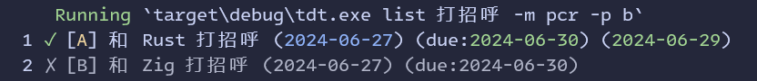
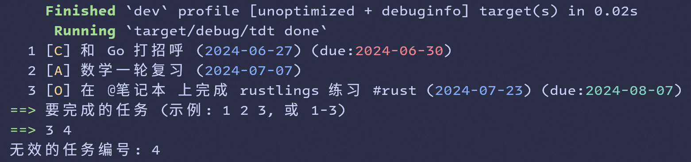

# To Do TXT

一个简单的命令行待办清单，以 TXT 文本的形式存储数据

受到了 [todo.txt](https://github.com/todotxt/todo.txt) 和 Microsoft Learn 中 [Rust 课程](https://learn.microsoft.com/zh-cn/training/modules/rust-create-command-line-program/) 的启发

## Usage

默认使用程序目录下的 `todo.txt` 文件，在 `cli` 模块中删除 `default_value` 后默认使用用户目录下的 `todo.txt` 文件

任务的各字段（如果有）格式为：

```
状态 [优先级] 内容 (创建日期) (due:截止日期) (完成日期)
```

- 状态 `✓` 表示已完成，`✗` 表示已移除，为空表示未完成
- 优先级有 A、B、C 和 O 四个等级，其中 O 表示无优先级
- 内容为任务的具体内容，可包含标签如 `#project` 项目、`@context` 上下文
- 创建日期为任务创建的日期
- 截止日期为任务的截止日期（可选）
- 完成日期为任务的完成日期（仅已完成的任务有）

支持如下 5 种操作：

- `add` 添加一个新任务
- `list` 列出任务
- `done` 标记任务为已完成
- `remove` 标记任务为已移除
- `delete` 删除任务

```shell
tdt add "这只是一个测试任务" --priority A --due-to 2024-09-01
```

`--priority` 和 `-p` 参数指定优先级，未指定时默认为 `O`

`--due-to` 和 `-d` 参数指定截止日期，未指定时默认为空

```shell
tdt list --mode pcr
```

`--mode` 和 `-m` 参数指定显示内容，可选值为 `p`、`c`、`r`，分别表示列出进行中的 `Pendding`、已完成的 `Completed`、已移除的 `Removed`，未指定时默认为 `p`



`done`、`remove` 和 `delete` 命令执行后会交互式选择任务，类似于 `yay`



## Next

- [ ] 将任务的 `#projects` 和 `@contexts` 字段改为标签 `#tags`
- [ ] 给除 `add` 外的命令添加 `Option<String>` 参数，用于搜索任务的内容
- [ ] 能按标签、优先级、截止日期筛选任务
- [ ] 能按优先级、截止日期排序任务
- [ ] 展示任务时倒序排列
- [ ] 支持范围操作，如 `1-3` 表示 1、2、3 三个任务
