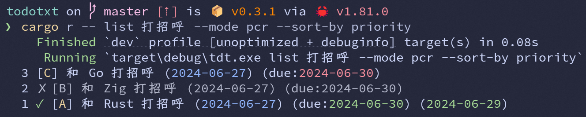
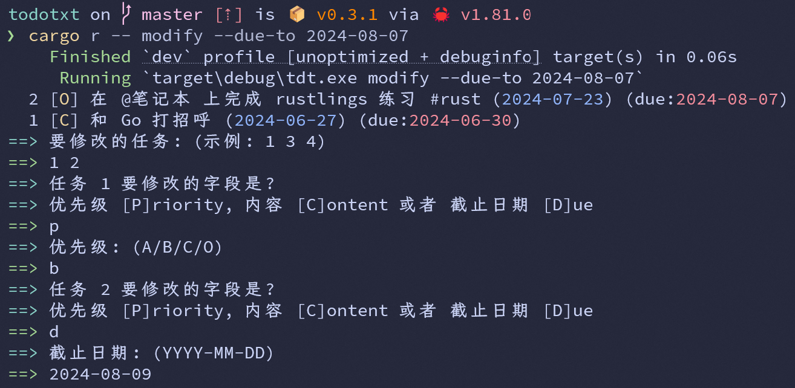

# To Do TXT

一个简单的命令行待办清单，以 TXT 文本的形式存储数据

受到了 [todo.txt](https://github.com/todotxt/todo.txt) 和 Microsoft Learn 中 [Rust 课程](https://learn.microsoft.com/zh-cn/training/modules/rust-create-command-line-program/) 的启发

## Usage

默认使用程序目录下的 `todo.txt` 文件，在 `cli` 模块中删除 `default_value` 后默认使用用户目录下的 `todo.txt` 文件

任务的各字段（如果有）格式为：

```
状态 [优先级] 内容 (创建日期) (due:截止日期) (完成日期)
```

- 状态 `✓` 表示已完成，`✗` 表示已移除，为空表示未完成
- 优先级有 A、B、C 和 O 四个等级，其中 O 表示无优先级
- 内容为任务的具体内容，可含有被空格包裹的标签 `#tag`
- 创建日期为任务创建的日期
- 截止日期为任务的截止日期（可选）
- 完成日期为任务的完成日期（仅已完成的任务有）

支持如下 6 种操作：

- `add` 添加一个新任务
- `list` 列出任务
- `done` 标记任务为已完成
- `modify` 修改任务
- `remove` 标记任务为已移除
- `delete` 删除任务

```shell
tdt add "这只是一个测试任务" --priority A --due-to 2024-09-01
```

`--priority` 或 `-p` 参数指定优先级，未指定时默认为 `O`

`--due-to` 或 `-d` 参数指定截止日期，未指定时默认为空

```shell
tdt list 打招呼 --mode pcr --tag 学习 --priority B --due-to 2024-09-01 --sort-by priority
```

关键词（如 `打招呼` ）用于搜索任务的内容，未指定时默认为空

`--mode` 或 `-m` 参数指定显示内容，可选值为 `p`、`c`、`r`，分别表示列出进行中的 `Pendding`、已完成的 `Completed`、已移除的 `Removed`，未指定时默认为 `p`

`--tag` 或 `-t` 参数指定标签，未指定时默认为空

`--priority` 或 `-p` 参数指定优先级，会筛选出大于等于该优先级的任务，未指定时默认为空

`--due-to` 或 `-d` 参数指定截止日期，会筛选出截止日期在该日期之前（包含当日）的任务，未指定时默认为空

`--sort-by` 或 `-s` 参数指定排序方式，可选值为 `priority` / `p` 和 `due-to` / `d`，分别表示按优先级和截止日期排序，未指定时默认为空（即按创建日期排序）



`done`、`modify`、`remove` 和 `delete` 命令参数类似于 `list`，但执行后会交互式选择任务，类似于 `yay`



## Next

- [x] 将任务的 `#projects` 和 `@contexts` 字段改为标签 `#tags`
- [x] 给除 `add` 外的命令添加 `Option<String>` 参数，用于搜索任务的内容
- [x] 能按标签、优先级、截止日期筛选任务
- [x] 能按优先级、截止日期排序任务
- [x] 展示任务时倒序排列
